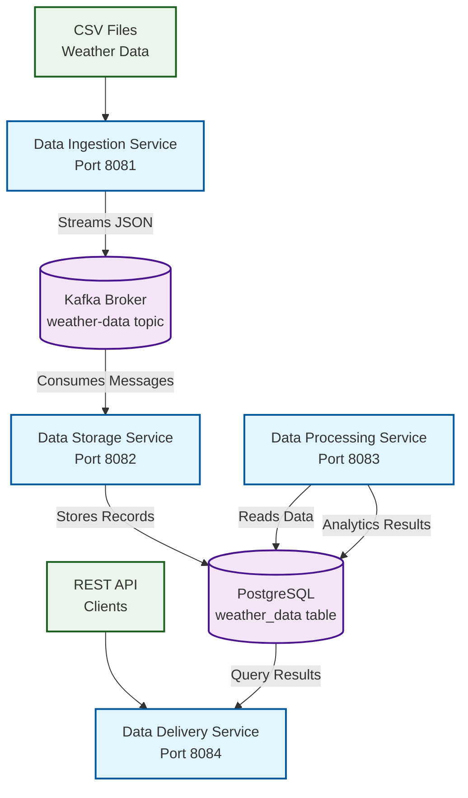
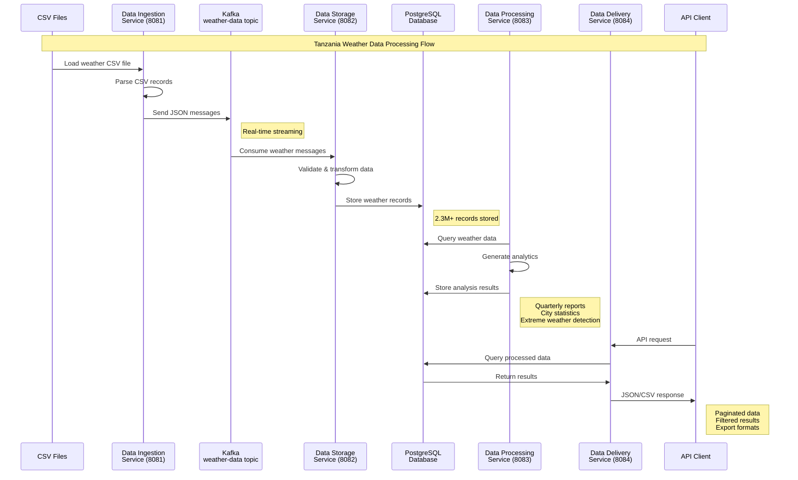

# Tanzania Weather Data Batch Processing System Documentation

## Project Overview

This project is a microservices-based system designed to process, analyze, and deliver weather data from Tanzania. The system handles over 2.3 million weather records from various Tanzanian cities including Mbeya, Dar es Salaam, Arusha, and other major urban centers.

## System Purpose

The system serves multiple purposes:
- Process large volumes of weather data efficiently
- Provide real-time data streaming and storage
- Generate analytical insights and reports
- Offer easy data access through REST APIs
- Support research, planning, and decision-making activities

## System Architecture

The system follows a microservices architecture pattern with four independent services communicating through Apache Kafka message streaming and sharing a PostgreSQL database.



## Service Components

### 1. Data Ingestion Service (Port 8081)

**Purpose**: Reads weather data from CSV files and streams it to Kafka topics.

**Key Functions**:
- Parse CSV files containing weather measurements
- Validate data format and structure
- Send individual weather records to Kafka topics
- Handle European decimal format conversion
- Process large files asynchronously

**Technology Stack**:
- Spring Boot
- Spring Kafka Producer
- CSV parsing utilities

**Key Classes**:
- `WeatherDataController` - REST endpoints for data ingestion
- `WeatherDataProducer` - Kafka message producer
- `WeatherRecord` - Data model for weather measurements

### 2. Data Storage Service (Port 8082)

**Purpose**: Consumes weather data from Kafka and persists it to PostgreSQL database.

**Key Functions**:
- Listen to Kafka weather-data topic
- Parse JSON messages from Kafka
- Validate and store weather records in database
- Handle duplicate detection and error recovery
- Maintain data integrity and indexing

**Technology Stack**:
- Spring Boot
- Spring Kafka Consumer
- Spring Data JPA
- PostgreSQL

**Key Classes**:
- `WeatherDataConsumer` - Kafka message consumer
- `WeatherDataEntity` - JPA entity for database persistence
- `WeatherDataRepository` - Data access layer

### 3. Data Processing Service (Port 8083)

**Purpose**: Performs analytics and generates insights from stored weather data.

**Key Functions**:
- Generate quarterly weather reports
- Calculate city-specific statistics
- Identify extreme weather events
- Compute temperature, humidity, and rainfall trends
- Create analytical summaries

**Technology Stack**:
- Spring Boot
- Spring Data JPA
- Statistical processing algorithms

**Key Classes**:
- `WeatherAnalyticsController` - REST endpoints for analytics
- `WeatherAnalyticsService` - Business logic for data analysis
- `WeatherDataRepository` - Data access for analytics

### 4. Data Delivery Service (Port 8084)

**Purpose**: Provides REST API access to weather data and analytics.

**Key Functions**:
- Serve weather data through REST endpoints
- Support filtering by city, date range, and temperature
- Provide paginated responses for large datasets
- Export data in CSV format
- Generate real-time statistics

**Technology Stack**:
- Spring Boot
- Spring Web
- Spring Data JPA
- REST API development

**Key Classes**:
- `WeatherDataController` - REST endpoints for data access
- `WeatherDataService` - Business logic for data delivery
- `WeatherDataRepository` - Data access layer

## Data Flow Process



## Data Model

### Weather Data Entity

The core data structure contains the following fields:
- **ID**: Unique identifier (auto-generated)
- **Timestamp**: Date and time of measurement
- **City**: Tanzanian city name
- **Temperature**: Temperature in Celsius
- **Humidity**: Humidity percentage
- **Rainfall**: Rainfall in millimeters
- **Wind Speed**: Wind speed in km/h
- **Pressure**: Atmospheric pressure in hPa
- **Created At**: Record creation timestamp
- **Processed**: Processing status flag

### Database Schema

```sql
CREATE TABLE weather_data (
    id BIGSERIAL PRIMARY KEY,
    timestamp TIMESTAMP NOT NULL,
    city VARCHAR(50) NOT NULL,
    temperature DOUBLE PRECISION NOT NULL,
    humidity DOUBLE PRECISION NOT NULL,
    rainfall DOUBLE PRECISION NOT NULL,
    wind_speed DOUBLE PRECISION NOT NULL,
    pressure DOUBLE PRECISION NOT NULL,
    created_at TIMESTAMP NOT NULL,
    processed BOOLEAN NOT NULL DEFAULT FALSE
);

CREATE INDEX idx_city ON weather_data(city);
CREATE INDEX idx_timestamp ON weather_data(timestamp);
CREATE INDEX idx_city_timestamp ON weather_data(city, timestamp);
```

## Infrastructure Components

### Apache Kafka
- **Topic**: weather-data
- **Purpose**: Real-time message streaming between services
- **Configuration**: Single partition for development
- **Message Format**: JSON with weather measurements

### PostgreSQL Database
- **Database Name**: weather_data
- **Table**: weather_data
- **Indexes**: Optimized for city and timestamp queries
- **Connection Pool**: Configured for concurrent access

### Docker Services
- **Zookeeper**: Kafka coordination service (Port 2181)
- **Kafka Broker**: Message streaming platform (Port 9092)
- **PostgreSQL**: Database server (Port 5432)
- **Kafka UI**: Web interface for monitoring (Port 8080)

## API Endpoints

### Data Delivery Service (Port 8084)

| Endpoint | Method | Description |
|----------|--------|-------------|
| `/api/weather/health` | GET | Service health status |
| `/api/weather/cities` | GET | List available cities |
| `/api/weather/city/{cityName}` | GET | Weather data by city (paginated) |
| `/api/weather/latest` | GET | Latest weather records |
| `/api/weather/stats` | GET | Statistical summaries |
| `/api/weather/search` | GET | Search with filters |
| `/api/weather/export/csv` | GET | Export data as CSV |

### Data Processing Service (Port 8083)

| Endpoint | Method | Description |
|----------|--------|-------------|
| `/api/analytics/quarterly` | POST | Generate quarterly reports |
| `/api/analytics/status` | GET | Processing status |
| `/api/analytics/report` | GET | Retrieve generated reports |
| `/api/analytics/health` | GET | Service health check |

### Data Ingestion Service (Port 8081)

| Endpoint | Method | Description |
|----------|--------|-------------|
| `/api/weather/ingest` | POST | Start data ingestion |
| `/api/weather/ingest/local` | POST | Ingest local Tanzania data |
| `/api/weather/test` | POST | Send test data |
| `/api/weather/health` | GET | Service health check |

## System Requirements

### Hardware Requirements
- **Memory**: Minimum 4GB RAM (8GB recommended)
- **Storage**: At least 10GB free space
- **CPU**: Multi-core processor recommended
- **Network**: Stable internet connection for Docker pulls

### Software Requirements
- **Java**: Version 17 or higher
- **Docker**: Latest version with Docker Compose
- **Maven**: Version 3.6 or higher
- **Git**: For source code management

## Installation and Deployment

### Prerequisites Setup

1. **Install Java 17+**
   ```bash
   # Verify Java installation
   java -version
   ```

2. **Install Docker and Docker Compose**
   ```bash
   # Verify Docker installation
   docker --version
   docker-compose --version
   ```

3. **Install Maven**
   ```bash
   # Verify Maven installation
   mvn --version
   ```

### Project Setup

1. **Clone the repository**
   ```bash
   git clone <repository-url>
   cd batch-processing-system
   ```

2. **Start infrastructure services**
   ```bash
   docker-compose up -d
   ```

3. **Verify infrastructure is running**
   ```bash
   # Check container status
   docker-compose ps
   
   # Access Kafka UI at http://localhost:8080
   # PostgreSQL available at localhost:5432
   ```

### Service Deployment

Start services in the following order:

1. **Data Storage Service** (Must be first to consume Kafka messages)
   ```bash
   cd data-storage-service
   ./mvnw spring-boot:run
   ```

2. **Data Ingestion Service**
   ```bash
   cd data-ingestion-service
   ./mvnw spring-boot:run
   ```

3. **Data Processing Service**
   ```bash
   cd data-processing-service
   ./mvnw spring-boot:run
   ```

4. **Data Delivery Service**
   ```bash
   cd data-delivery-service
   ./mvnw spring-boot:run
   ```

### Verification

Check all services are running:
```bash
curl http://localhost:8081/api/weather/health  # Data Ingestion
curl http://localhost:8082/actuator/health     # Data Storage
curl http://localhost:8083/api/analytics/health # Data Processing
curl http://localhost:8084/api/weather/health   # Data Delivery
```

## Usage Examples

### Data Ingestion
```bash
# Ingest Tanzania weather data
curl -X POST http://localhost:8081/api/weather/ingest/local

# Send test data
curl -X POST http://localhost:8081/api/weather/test
```

### Data Access
```bash
# Get all cities
curl http://localhost:8084/api/weather/cities

# Get weather data for Mbeya
curl "http://localhost:8084/api/weather/city/Mbeya?page=0&size=10"

# Search with temperature filter
curl "http://localhost:8084/api/weather/search?minTemp=25&maxTemp=35"

# Export data as CSV
curl "http://localhost:8084/api/weather/export/csv?city=Mbeya"
```

### Analytics
```bash
# Generate quarterly report
curl -X POST http://localhost:8083/api/analytics/quarterly

# Get processing status
curl http://localhost:8083/api/analytics/status

# Retrieve generated report
curl http://localhost:8083/api/analytics/report
```
